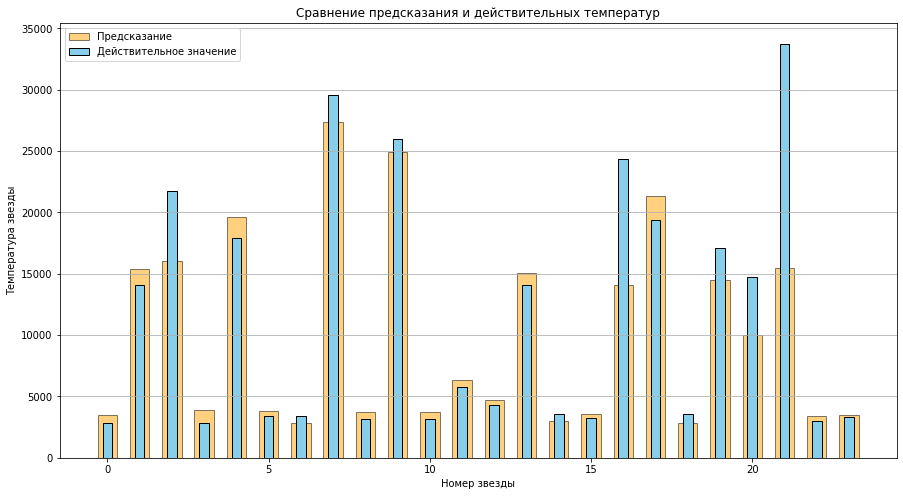

**Описание проекта**    
Проект разрабатывается для обсерватории "Небо на ладони" с целью создания модели машинного обучения, способной предсказывать температуру на поверхности звезд по их характеристикам. Имеющиеся традиционные методы расчета температуры (закон смещения Вина, закон Стефана-Больцмана и спектральный анализ) требуют альтернативного решения для повышения точности измерений.

**Цель проекта**
Разработка нейронной сети, обеспечивающей прогнозирование абсолютной температуры звезды (в Кельвинах) с ошибкой RMSE не более 4500.

----

**Результаты:**     
1. **Был проведен анализ и подготовка данных**:
   - выборка очень маленькая 
   - данные имеют выбросы
   - пропуски отстуствуют
   - устранены неявные дубликаты, и укрупнен признак цвета звезды
   

2. **Построена базовой модель нейронной сети**
   - Нейросеть имеет 4 скрытых слоя
   - Размер батча равен 1, 30 эпох
   - Метрики на тесте составили **RMSE: 3919**
   

3. **Оптимизация модели**   
   - Выставлена регуляризацией (Dropout = 0.1)  
   - Метрики на тесте составили **RMSE: 4660**  
   - График на train/test loss стал более амлитудный  
   

4. **Итог**   
Лучшей моделью стала базовая. Данная модель выполнила задание и показала RMSE меньше 4500.     
По графику сравнений предсказаний можно сделать вывод, что модель ошибается на выбросах,     
где значения температуры очень высокие. Улучшить модель можно, увеличив размерность датасета  

